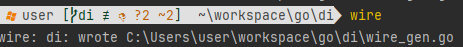

DI BY Wire

使用wire 進行 DI 重構練習

## install

安裝並取得wire

```shell
go get github.com/google/wire/cmd/wire
```

## generate

自動產生DI所需檔案

```shell
wire
```



## Example

以下三個branch分別代表三種不同作法，可以參考實作時差異之處

master: 沒有使用DI

di: 手動DI

di_wire: 透過wire進行DI